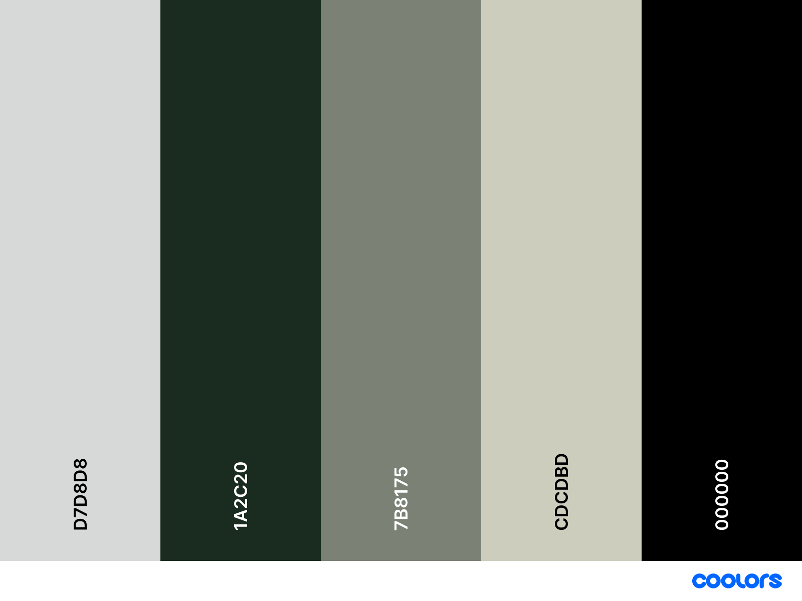
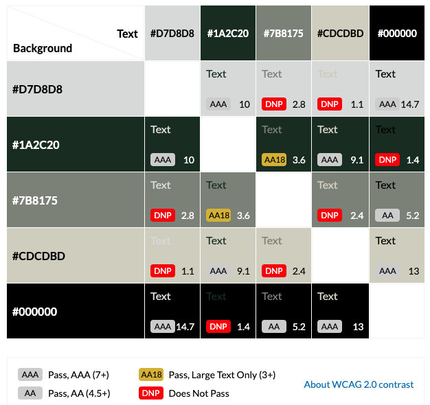

<h1 align="center">Beckminster Crest</h1>

[Beckminster Crest](Live project will be added here)

The Beckminster Crest website provides key details about the prestigious, private school to parents, students, faculty and its other users. It has been created to deliver a smooth and responsive experience through a user focused design with a tidy layout that provides effortless navigation between pages, effectively working on multiple devices.

<h2 align="center"> (Image of will be added here)</h2>

### [Contents](#contents)
* [User Goals](#user-goals)
* [User Stories](#user-stories)
* [Website Goals and Objectives](#website-goals-and-objectives)
* [Wireframes](#wireframes)
* [Design Choices](#design-choices)
    + [Typography](#typography)
    + [Colour Scheme](#colour-scheme)
    + [Images](#images)
    + [Responsiveness](responsiveness)
- [Features](#features)
    * [Existing Features](existing-features)
        + [Header](#header)
            - [Home](#home)
            - [Admissions](#admissions)
            - [Parent Information](#parent-information)
            - [Contact Us](#contact-us)
        + [Landing View](#landing-view)
        + [Home View](#home-view)
        + [Admissions View](#admissions-view)
        + [Parent Information View](#parent-information-view)
        + [Contact Us View](#contact-us-view)
        + [Footer](#footer)
    * [Future Enhancements](#future-enhancements)
- [Technologies Used](#technologies-used)
    * [Languages](#languages)
    * [Libraries and Framework](#libraries-and-framework)
    * [Tools](*tools)
- [Testing](#testing)
    * [Bugs](#bugs)
    * [Responsiveness Tests](#responsiveness-tests)
    * [Code Validation](#code-validation)
        + [HTML](#html)
        + [CSS](#css)
    * [User Story Testing](#user-story-testing)
    * [Feature Testing](#feature-testing)
    * [Accessibility Testing](#accessibility-testing)
    * [Lighthouse Testing](#lighthouse-testing)
    * [Browser Testing](*browser-testing)
- [Deployment](#deployment)
    * [To Deploy the Project](#to-deploy-the-project)
    * [To Fork the Project](#to-fork-the-project)
    * [To Clone the Project](#to-clone-the-project)
- [Credits](#credits)

## User Goals

* User friendly navigation.
* Inform and engage current families.
* Attract prospective students and families.
* Establish a clear brand identity.
* Clearly display admission and boarding costs.
* Opportunity to contact the school.

[Back to contents](#contents)

## User Stories

* As a user, I want to find information about the school including the age range of students and who the current headmaster is.
* As a user, I want to be able to find when the next open day is.
* As a user, I want to be able to easily find the schools contact information.
* As a user, I want to be able to find out the fees for admission and boarding.
* As a user, I want to be able to request as brochure.
* As a user, I want to be able to find term dates.
* As a user, I want to be able to find the uniform list.
* As a user, I want to be able to use the website on a range of devices.
* As a user, I want to be able to contact the school.
* As a user, I want easy to find navigation to the website’s different pages.
* As a user, I want to be able to contact the school regarding any absences.
* As a user, I want to be able to find the schools social media accounts.
* As a user, I would like to see the location of the school on a map to help with directions.

[Back to contents](#contents)

## Website Goals and Objectives

* Provide information to current students and families.
* Attract prospective students and families to engage with the website.
* Offer useful and accurate information to encourage users to explore the website.
* Give users the option to contact the school through a form with options such as, general enquires, school absences, request a brochure, enrichments, visit the school, scholarships and bursaries, career opportunities.
* Website should be functional on various devices.

[Back to contents](#contents)

## Target Audience

* Current students and their families
* Potential students and their families
* Current faculty
* Potential faculty
* School inspectors
* Local public

[Back to contents](#contents)

## Wireframes

(Information regarding wirefames will be added here)

## Design Choices

### Typography

(Information regarding chosen font with reasons will be added here)

### Colour Scheme

The website colour scheme has been chosen using the school's branding colours, this helps to keep the connection and branding consistent. 

Running the colour scheme through [Contrast Grid](https://contrast-grid.eightshapes.com/?version=1.1.0&background-colors=&foreground-colors=%23D7D8D8%0D%0A%231A2C20%0D%0A%237B8175%0D%0A%23CDCDBD%0D%0A%23000000&es-color-form__tile-size=compact&es-color-form__show-contrast=aaa&es-color-form__show-contrast=aa&es-color-form__show-contrast=aa18&es-color-form__show-contrast=dnp) provides the best colour combinations to use for the website to ensure its visually appealing and easy to read as well as which combinations are best to be avoided.

|CSS Name               |HEX          |Use
|-----------------------|-------------|---------------------------|
|   --platinum          |   #d7d8d8   |                           |
|   --dark-green        |   #1a2c20   |                           |
|   --battleship-gray   |   #7b8175   |                           |
|   --bone              |   #cdcdbd   |                           |
|   --black             |   #000000   |                           |

### Images

(Information regarding the images used will be added here)

### Responsiveness

(Information regarding the responsiveness of the website will be added here)

# Features

(Information regarding features will be added here)

## Existing Features

### Header

#### Home

#### Admission

#### Parent Information

#### Contact Us

### Landing View

### Home View

### Admissions View

### Parent Information View

### Contact Us View

### Footer 

## Future Enhancements

# Technologies Used

## Languages

## Libraries and Framework

## Tools

# Testing

## Bugs

## Responsiveness Tests

## Code Validation

### HMTL

### CSS

## User Story Testing

## Feature Testing

## Accessibility Testing

## Lighthouse Testing

## Browser Testing

# Deployment

## To Deploy the Project

## To Fork the Project

## To Clone the Project

# Credits

#### Images:

- [ChatGPT](https://chatgpt.com/ "ChatGPT")
- [Favicon.io](https://favicon.io/favicon-converter/ "Favicon.io")
- [Pexels](https://www.pexels.com/ "Pexels")
- [Squoosh](https://squoosh.app/ "Squoosh")
- [Unsplash](https://unsplash.com/ "Unsplash")

#### Visual Content:

- [Balsamiq](https://balsamiq.com/education/ "Balsamiq")
- [Contrast Grid](https://contrast-grid.eightshapes.com/?version=1.1.0&background-colors=&foreground-colors=%23C0C0C0%0D%0A%2373937E%0D%0A%23053501%0D%0A%23000000%0D%0A%23FFFFFF&es-color-form__tile-size=compact&es-color-form__show-contrast=aaa&es-color-form__show-contrast=aa&es-color-form__show-contrast=aa18&es-color-form__show-contrast=dnp "Contrast Grid")
- [Coolors](http://https://coolors.co/ "Coolors")
- [Font Awesome](https://fontawesome.com/search?q=menu&o=r&ic=free "Font Awesome")