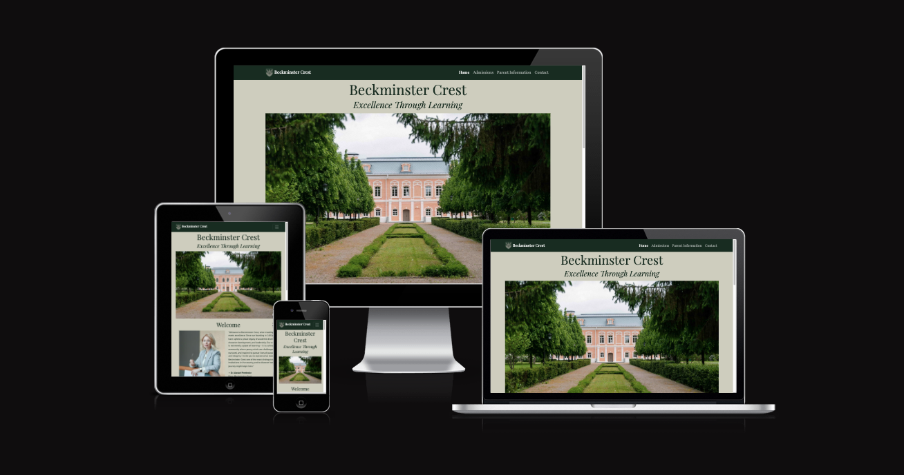
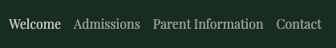
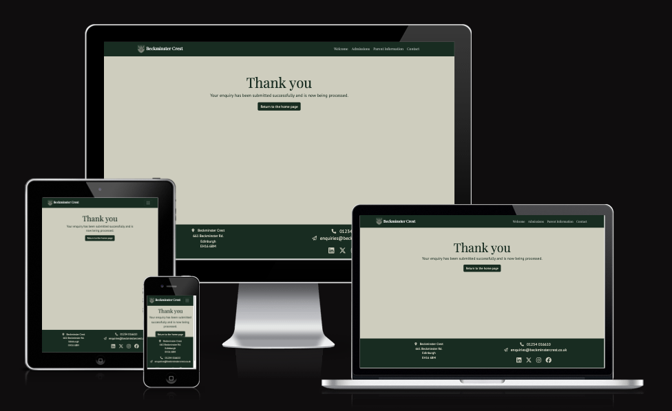
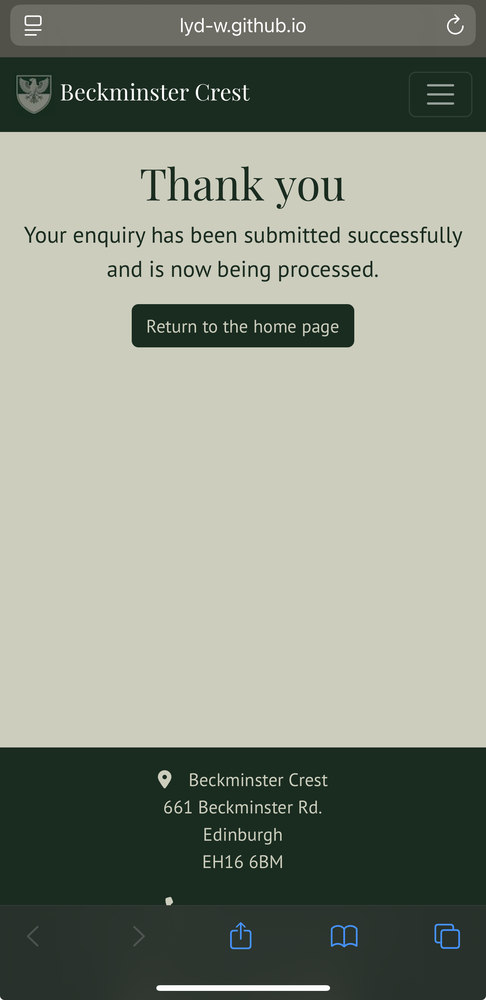

# Beckminster Crest

[Beckminster Crest](https://lyd-w.github.io/beckminster-crest/)

The Beckminster Crest website provides key details about the prestigious, private school to parents, students, potential families, faculty and its other users. It has been created to deliver a smooth and responsive experience through a user focused design with a tidy layout that provides effortless navigation between pages, effectively working on multiple devices.

### [Contents](#contents)
* [User Goals](#user-goals)
* [User Stories](#user-stories)
* [User Feedback](#user-feedback)
* [Website Goals and Objectives](#website-goals-and-objectives)
* [Target Audience](#target-audience) 
* [Wireframes](#wireframes)
* [Design Choices](#design-choices)
    + [Typography](#typography)
    + [Colour Scheme](#colour-scheme)
    + [Images](#images)
    + [Videos](#videos)
    + [Responsiveness](responsiveness)
- [Features](#features)
    * [Existing Features](existing-features)
        + [Header](#header)
        + [Home View](#home-view)
        + [Admissions View](#admissions-view)
        + [Parent Information View](#parent-information-view)
        + [Contact Us View](#contact-us-view)
        + [Footer](#footer)
    * [Future Enhancements](#future-enhancements)
- [Technologies Used](#technologies-used)
    * [Languages](#languages)
    * [Libraries, Frameworks, Tools and Programmes Used](#libraries-frameworks-tools-and-programmes-used)
- [Testing](#testing)
    * [Bugs](#bugs)
    * [Responsiveness Tests](#responsiveness-tests)
    * [Code Validation](#code-validation)
        + [HTML](#html)
        + [CSS](#css)
    * [User Story Testing](#user-story-testing)
    * [Feature Testing](#feature-testing)
    * [Accessibility Testing](#accessibility-testing)
    * [Lighthouse Testing](#lighthouse-testing)
    * [Browser Testing](*browser-testing)
- [Deployment](#deployment)
- [Credits](#credits)

## User Goals

* User friendly navigation.
* Inform and engage current families.
* Attract prospective students and families.
* Establish a clear brand identity.
* Clearly display admission and boarding costs.
* Opportunity to contact the school.

[Back to contents](#contents)

## User Stories

* As a user, I want to find information about the school including the age range of students and who the current headmaster is.
* As a user, I want to be able to find when the next open day is.
* As a user, I want to be able to easily find the school's contact information.
* As a user, I want to be able to find out the fees for admission and boarding.
* As a user, I want to be able to request a brochure.
* As a user, I want to be able to find term dates.
* As a user, I want to be able to find the uniform list.
* As a user, I want to be able to use the website on a range of devices.
* As a user, I want to be able to contact the school.
* As a user, I want easy to find navigation to the website’s different pages.
* As a user, I want to be able to contact the school regarding any absences.
* As a user, I want to be able to find the schools social media accounts.
* As a user, I would like to see the location of the school on a map to help with directions.
* As a user, I want to be able to see what the school offers in addition to the standard curriculum, supported with photos.
* As a user, I would like to be able to watch a video to indicate what Beckminster Crest can offer my child.
* As a user, I would like to hear a student's perspective of their school experience.
* As a user, I would prefer the website to be a one-page, scrollable website.

[Back to contents](#contents)

## User Feedback

 After obtaining feedback from users during the late development stage, it was evident that a free-flowing, one-page style website would be preferred to allow users to continuously scroll down the website with the next page following on, rather than accessing it through clicking on the page title in the navbar. This style suits a more modern approach, offering a streamlined user experience, where the user can scroll to browse what is included on the website, only stopping to read relevant sections to them. It also improves the user experience as the website would flow more naturally, especially when accessing the website on a mobile phone which, according to [Statista](https://www.statista.com/statistics/277125/share-of-website-traffic-coming-from-mobile-devices/ "Statista Article") is how more than half of website traffic is now accessed.

 This feedback has resulted in updated wireframes and the additional user story:
 * As a user, I would prefer the website to be a one-page, scrollable website.

## Website Goals and Objectives

* Provide information to current students and families.
* Attract prospective students and families to engage with the website.
* Offer useful and accurate information to encourage users to explore the website.
* Give users the option to contact the school through a form with options such as, general enquires, school absences, request a brochure, visit the school, scholarships and bursaries, career opportunities.
* The website should be functional on various devices.

[Back to contents](#contents)

## Target Audience

* Current students and their families
* Potential students and their families
* Current faculty
* Potential faculty
* School inspectors
* Local public

[Back to contents](#contents)

## Wireframes

The original wireframes were designed using templates from [Balsamiq](https://balsamiq.com/ "Balsamiq Homepage") which I then sketched the website's layout onto. I started with the mobile version, then tablet and finally the display on a laptop. I aimed for detailed wireframes to help visualise the final product to ensure it met the user requirements while remaining an enjoyable experience, this also made designing the website easier.

[Mobile Wireframes](docs/beckminster-crest-mobile-wireframe.pdf "Mobile Wireframes")

[Tablet Wireframes](docs/beckminster-crest-tablet-wireframe.pdf "Tablet Wireframes")

[Desktop Wireframes](docs/beckminster-crest-laptop-wireframe.pdf "Laptop Wireframes")

User feedback showed a one-page, scrollable wesbite would be preferred, I re-designed the wireframes using [Balsamiq](https://balsamiq.com/ "Balsamiq Homepage") to suit the new requirements. Like with the original wireframes, I designed the mobile version first, followed by the tablet version and lastly the desktop version. This time the process was much easier as I had more experience with how the website would look, feel and function from previous designing.

[Updated Mobile Wireframes](docs/updated-mobile-wireframes.pdf "Updated Mobile Wireframes")

[Updated Tablet Wireframes](docs/updated-tablet-wireframes.pdf "Updated Tablet Wireframes")

[Updated Desktop Wireframes](docs/updated-desktop-wireframes.pdf "Updated Laptop Wireframes")

The final website does deviate from the updated wireframes slightly, especially in the contact section where the order of elements has been altered for a more natural flow. I have also added an accordion feature for the uniform table, with the table holding large amounts of data, it felt overwhelming which would reduce the user experience.

[Back to contents](#contents)

## Design Choices

### Typography

The two chosen font families for the Beckminster Crest website are [Playfair Display](https://fonts.google.com/specimen/Playfair+Display "Google Fonts | Playfair Display") for headings, it has a formal, business like style and it would also be suitable for other school branding, such as for letter headings. The second chosen font family is [PT Sans](https://fonts.google.com/specimen/PT+Sans "Google Fonts | PT Sans"), it is a softer, more rounded font style making it easier to read bigger bodies of text. By using font families that the school could adapt, it would reinforce the brand identity and keep a consistent image.

### Colour Scheme

As the school does not exist, I created a [logo](docs/beckminster-crest-logo.png "Beckminster Crest Logo") using [ChatGPT](https://chatgpt.com/ "ChatGPT Homepage"), I used similar colours to the logo to support brand identity throughout the website. For the website, I took the base colours from the logo and introduced two other colours that complimented the original colours, these offer more contrast, especially for highlighting.

I used [Coolors Scheme](https://coolors.co/ "Coolors Scheme Homepage") to select similar colours to the logo and visualise different colours together before making my final selection. 

I then used [Contrast Grid](https://contrast-grid.eightshapes.com/?version=1.1.0&background-colors=&foreground-colors=%23D7D8D8%0D%0A%231A2C20%0D%0A%237B8175%0D%0A%23CDCDBD%0D%0A%23000000&es-color-form__tile-size=compact&es-color-form__show-contrast=aaa&es-color-form__show-contrast=aa&es-color-form__show-contrast=aa18&es-color-form__show-contrast=dnp "Contract Grid | Chosen Colour Scheme") to provide the best colour combinations to use for the website to ensure it will be visually appealing and easy to read as well as which combinations are best to be avoided to reduce the possibility of accessibility issues. 

|CSS Name               |HEX          |Use
|-----------------------|-------------|------------------------------------------------|
|   --platinum          |   #d7d8d8   | Light highlight colour                          |
|   --dark-green        |   #1a2c20   | Header and body font colour, navbar and footer |
|                       |             | background colour, buttons                     |
|   --battleship-gray   |   #7b8175   | Highlight colour, button and social media hover|
|   --bone              |   #cdcdbd   | Background colour, secondary text for buttons, |
|                       |             | navbar, footer                                 |
|   --black             |   #000000   | Dark highlight colour                          |

All colours were used except for #d7d8d8, although it was one of the colours to score the highest contrast score on [Contrast Grid](https://contrast-grid.eightshapes.com/?version=1.1.0&background-colors=&foreground-colors=%23D7D8D8%0D%0A%231A2C20%0D%0A%237B8175%0D%0A%23CDCDBD%0D%0A%23000000&es-color-form__tile-size=compact&es-color-form__show-contrast=aaa&es-color-form__show-contrast=aa&es-color-form__show-contrast=aa18&es-color-form__show-contrast=dnp "Contract Grid | Chosen Colour Scheme"), it did not feel in keeping with the schools elegant, more sophisticated style. If the website was to be expanded in the future, it could be used for extra styling and lighter highlights.

### Images

As the school is an imaginary school, the logo design has been created by [ChatGPT](https://chatgpt.com/ "ChatGPT Homepage"). The images used throughout the website are from [Unsplash](https://unsplash.com/ "Unsplash Homepage") and [Pexels](https://www.pexels.com/ "Pexels Homepage"), using [Squoosh](https://squoosh.app/ "Squoosh Homepage") to format and resize the images. I focused on images that are relevant to a school, looking for grand school buildings, green outdoor spaces, formal dress code as well as a more relaxed dress style to demonstrate enrichment activities.

To improve the performance of the website, I resized and reduced the photo quality using [Squoosh](https://squoosh.app/ "Squoosh Homepage") to provide a better user experience when using the website.

### Videos

The video included is from [Pexels](https://www.pexels.com/ "Pexels Homepage"), it was formatted and resized using [Videobolt](https://videobolt.net/simple-video-tools/resize "Videobolt | Resize Your Video") to make it a more manageable size for the website. I chose this video as it carries on the natural aesthetics that I am aiming for throughout the website.

### Responsiveness

The website is responsive to different screen sizes with the breakpoints taken from [Bootstrap](https://getbootstrap.com/docs/5.3/layout/breakpoints/#available-breakpoints "Bootstrap Breakpoints"). There are media queries added to the CSS to determine the correct media query for different viewpoints, establishing a consistent level of user experiences over different devices.

[Back to contents](#contents)

# Features

A website with a clear and easy to use layout that is responsive on all devices that can be recognised as the school's website through the use of the school's logo, colours and font families. The user can easily find the information they require on the clearly identified pages/sections with the ability to use a contact form if they have further enquires. There are also images throughout the site to demonstrate different aspects of the school with a large focus on enrichment activities that are displayed in a carousel. To encourage interaction, there is a video showing footasge of a student participating in mermaid swimming, I chose to display this activity as it is unique and more likely to attract interest whilst highlighting Beckminster Crest encourages and supports all types of enrichment. 

Due to the large amount of information required for the uniform table, I chose to add a [Bootstrap accordion](https://getbootstrap.com/docs/5.3/components/accordion/ "Bootstap - Accordion) feature so the user can open the full table if required, this prevents unnecessary visual clutter and scrolling. To help users locate where the school is, a location shown using [Google Maps](https://www.google.com/maps/place/Edinburgh+Castle/@55.9485977,-3.2024938,17z/data=!3m1!4b1!4m6!3m5!1s0x4887c79a2099c0f7:0x469a1eebe54c0a58!8m2!3d55.9485947!4d-3.1999135!16zL20vMGpwbl8?entry=ttu&g_ep=EgoyMDI1MDczMC4wIKXMDSoASAFQAw%3D%3D "Google Maps | Edinburgh Castle") has bdeen included. As the school does not exist, the location used is Edinburgh Castle.

## Existing Features

### Navigation

The website has a navigation stysem that has a consistent style across screen sizes, on smaller screens such as mobiles and tablets, the navigation compacts down into an expandable menu. The Beckminster Crest logo is shown within the navbar and both the logo and the Beckminster Crest text can be clicked to jump back to the home page to offer a more convenient user experience.

<b>Mobile navigation closed</b>

 

<b>Mobile navigation open</b>

 

<b>Tablet navigation closed</b>

 

<b>Tablet navigation open</b>

 

<b>Laptop navigation</b>

 

The navigation on laptops has a highlight effect when hovered over with the mouse to create an engaging experience for the user.

<b>Laptop navigation | welcome highlight</b>

 

<b>Laptop navigation | admissions highlight</b>

<b>Laptop navigation | parent information highlight</b>

 

<b>Laptop navigation | contact highlight</b>

 

### Header

The Beckminster Crest website has consistent headers on all devices, showing the schools name in the header font, followed by the schools slogan in the same font in italics.

<b>Mobile header</b>

 

<b>Tablet header</b>

 

<b>Laptop header</b>

 

### Home Section

The home view features the schools name and slogan in eye catching text along with a photo of the main school building. It carries a consistent style across different devices using the schools colours as well as being responsive.

 

### Welcome Section

The Welcome section features a photo of the Dean of Backminster Crest along with a welcome written by her. On mobile devices, the welcome text is displayed after the photo of the Dean, as the user continues down this section, this style of layout continues. For tablets and larger screens the welcome text is displayed next to the photo of the Dean, demonstrating the responsiveness of the website, again this style of layout continues. Further down the Welcome section, there is an About section giving information about the school and a photo of the school grounds. The website then leads onto the Open Events section showing a table of open day events along with a paragraph of information.

 

### Admissions Section

The Admissions section shows the section header, followed by a paragraph containing information regarding admissions at Beckminster Crest. When viewing on mobile, to keep a consistent layout, the text and photos are stacked on each other with subheadings to guide the user. On tablets the layout mimics that of the mobile view to enhance the readability of tables and increase the visual impact of the carousel and video elements. On larger screens the carousel sits next to the enrichment information and the two tables for fees also sit next to each other, this improves the flow of the website without causing unused spaces. The carousel holds 8 photos and is set to be manually controlled to browse through the photos, this allows the user to look at their lesiure and does not cause distraction from autoplaying. Due to the nature of the video, it offers a calming effect. The video does not loop and has been muted to prevent sudden noise being played, it also has controls for user convenience.

 

<b>Carousel</b>

 

<b>Video</b>

 

### Parent Information Section

The Parent Information vsection conatins a breif paragraph including a link to the contact section for user convenience with the layout remaining consistent on different screen sizes. The Parent Information section displays term dates in a table and the schools unifrom list in a Bootstrap accodion feature, this helps to organise the website and reduces visual noise for the user.

 

<b>Accordion</b>

 

### Contact Section

The Contact section holds a paragraph of text regarding contacting the school, below this a location on Google Maps is included with the school's contact information. Below this there is a contact form for users to send in enquires about the school with some preset topics as well as a general enquiry for any topics not listed, the form has set field entry requirements to prevent submission of an incomplete form. The layout style, is again, consistent with the rest of the website with the mobile and tablet view showing the information stacked, moving onto larger screens, the location and schools contact information sit next to each other for a smoother finish.

 

<b>Contact form</b>

### Success Page

The website includes a Success page to give the user feedback regarding the status of their contact enquiry when the form has been filled in correctly, this helps to proivde a better experience for the user by informing them that their enquiry has been received. When using [Am I Responsive?](https://ui.dev/amiresponsive?url=https://lyd-w.github.io/beckminster-crest/success.html "Am I Responsive? | Success Page View"), I noticed the layout on the mobile screen loses the expected layout. I then checked this on an iPhone 12 Pro Max using both Safari and Edge to see whether this was a coding error or due to the way Am I Responsive? displays the success page. I found both browsers on iPhone to display the expected layout.

### Footer

The footer follows a consistant style across all devices, using the same background colour as the navbar. On mobile, the footer holds the school's address, contact details and social media links stacked on each other. For all other screens the school's address is displayed to the left and the contact details and social media links are displayed to the right. This provides quick and easy to find information for users wanting to contact the school.

<b>Mobile footer view</b>

 

<b>Tablet footer view</b>

 

<b>Laptop footer view</b>

  

## Future Enhancements

* Additional pages/sections
* Parent forum
* Student forum
* Virtual tour of the school
* Information and support applying to Universities
* Drone footage of the school and it's grounds
* A school news page
* A full school calendar including sporting events
* List of school accreditations
* Portals for different users (parents, students, faculty, alumni, agents, etc.)

[Back to contents](#contents)

# Technologies Used

## Languages

- [HTML](https://developer.mozilla.org/en-US/docs/Web/HTML "HTML")
- [CSS](https://developer.mozilla.org/en-US/docs/Web/CSS "CSS")

## Libraries, Frameworks, Tools and Programmes Used

- [Am I Responsive](https://ui.dev/amiresponsive?url=https://lyd-w.github.io/beckminster-crest/index.html "Am I Responsive")
- [Autoprefixer CSS online](https://autoprefixer.github.io/ "Autoprefixer CSS Online Homepage")
- [Balsamiq](https://balsamiq.com/ "Balsamiq")
- [Bootstrap v5.3](https://getbootstrap.com/ "Bootstrap v5.3")
- [Chat GPT](https://chatgpt.com/ "Chat GPT")
- [Favicon](https://favicon.io/ "Favicon")
- [Font Awesome](https://fontawesome.com/search?q=menu&o=r&ic=free "Font Awesome")
- [GitHub](https://github.com "GitHub")
- [Google Fonts](https://fonts.google.com/ "Google Fonts")
- [Responsive Deisgn Checker](https://responsivedesignchecker.com/ "Responsive Design Checker")
- [Videobolt](https://videobolt.net/simple-video-tools/resize "Videobolt")
- [VS Code](https://code.visualstudio.com/ "VS Code")
- [W3C CSS Validation Service](https://jigsaw.w3.org/css-validator/#validate_by_input "W3C CSS Validation Service")
- [W3C HTML Validation Service](https://validator.w3.org/#validate_by_input "W3C HTML Validation Service")

[Back to contents](#contents)

# Testing

## Bugs

I thoroughly tested the website in Safari and Chrome on a Macbook Pro and Safari and Edge on an iPhone 12 Pro Max. Throughout the development of the website, the following bugs were found:

|   Bug Description                         | Resolved |    Resolution Description                               |
|-------------------------------------------|----------|---------------------------------------------------------|
| Bootstrap element affecting layout on all | Yes      | Added --bs-gutter-x: 0; to the CSS to remove the gutter.|
| devices.                                  |          |                                                         |
| Carousel and video scrolled infront of    | Yes      | Increase the z-index of the navbar to position it in    |
| navbar.                                   |          | front.                                                  |
| Navbar links scrolled past the section    | Yes      | Added scroll-padding set to a minimum of the navbar     |
| headers.                                  |          | height.                                                 |
| Accordion button showed upside down but   | Yes      | Added -collapsed to the button element in HTML and set  |
| corrected after two clicks.               |          | aria-expanded to true.                                  |
| Uniform table expanded outside the        | Yes      | Set the text size on small screens within the media     |
| accordion body on mobile.                 |          | queries to 10px.                                        |
| Accordion button arrow became unaligned on| Yes      | Adjusted top and right margins within media queries.    |
| most screen sizes.                        |          |                                                         |
| Burger menu would not close automatically | Yes      | Added JavaScript code to HTML.                          |
| when a link was clicked.                  |          |                                                         |

## Responsiveness Tests

## Code Validation

### HMTL

### CSS

## User Story Testing

|User Story                               | Result                                      |Pass| Evidence             |
|-----------------------------------------|---------------------------------------------|----|----------------------|
| As a user, I want to find information   | The Home page displays information about    | P  |                      |
| about the school including the age range| the school including the age range of       |    |                      |
| of students and who the headmaster is.  | students and who the current headmaster is. | P  |                      |
| As a user, I want to be able to find    | The Home page has a table showing when the  | P  |                      |
| when the next open day is.              | next open day is.                           |    |                      |
| As a user, I want to be able to easily  | The schools contact information is listed in| P  |                      |
| find the schools contact information.   | the footer and there is a contact form on   |    |                      |
|                                         | the Contact page.                           |    |                      |
| As a user, I want to be able to find out| The Admissions page contains a table of fees| P  |                      |
| the fees for admission and boarding.    | including admission and boarding.           |    |                      | 
| As a user, I want to be able to request | On the Contact page, users can request a    | P  |                      |
| a brochure.                             | prospectus.                                 |    |                      |
| As a user, I want to be able to find    | A table of term dates can be found on the   | P  |                      | 
| term dates.                             | Parent Information page.                    |    |                      |
| As a user, I want to be able to find the| A uniform list can be found on the Parent   | P  |                      |
| uniform list.                           | Information page.                           |    |                      |
| As a user, I want to be able to use the | The website performs on a range of devices, | P  |                      |
| website on a range of devices.          | it's responsive across different viewpoints.|    |                      |
| As a user, I want to be able to contact | The school's contact information is listed  | P  |                      |
| the school.                             | in the footer and there is a contact form.  |    |                      |
| As a user, I want easy to find          | The navbar clearly displays the different   | P  |                      |
| navigation to the website’s different   | pages at the top of the website.            |    |                      |
| pages.                                  |                                             |    |                      |
| As a user, I want to be able to contact | The contact form on the Contact Page can be | P  |                      |
| the school regarding any absences.      | used to request an absence form.            |    |                      |
| As a user, I want to be able to find the| The school's social media accounts are linked| P  |                      |
| school's social media accounts.          | in the footer.                              |    |                      |
| As a user, I would like to see the      | On the Contact page, there is a google maps | P  |                      |
| location of the school on a map to help | location at the bottom of the page.         |    |                      |
| with directions.                        |                                             |    |                      |
| As a user, I want to be able to see     | The Admission page has information regarding| P  |                      |
| what the school offers in addition to   | enrichment activities including a carousel of|    |                      |
| the standard curriculum supported with  | photographs.                               |    |                      |
| photos.                                 |                                             |    |                      |
| As a user, I would like to be able to   | In the scholarship section, there is a video| P  |                      |
| watch a video to indicate what          | of a student undertaking mermaid swimming as|    |                      |
| Beckminster Crest can offer my child.   | an enrichment activity with a testimony.    |    |                      |
| As a user, I would like to hear a       | There is a student testimony included in the| P  |                      |
| students perspective of their school    | Scholarship section under the Admissions    |    |                      |
| experience.                             | page.                                       |    |                      |
| As a user, I would prefer the website to|
| be a one-page, scrollable website.      | 

[Back to contents](#contents)

## Feature Testing

## Accessibility Testing

## Lighthouse Testing

## Browser Testing

# Deployment

The Beckminster Crest website was deployed on GitHub early on in the development process to highlight any possible issues that could occur. The steps used to deploy the website are as follows:

- Open up the repository on GitHub.
- Select **'Settings'** from the top menu.
- Select **'Pages'** from the menu down the left-hand side.
- Change the **'None'** dropdown menu to **'Main'**.
- Click the **'Save'** button.
- Wait while the website is deployed.
- The website is now live and accessible at: **https://lyd-w.github.io/beckminster-crest/**

Changes can still be made to the website through VS Code, they become live once they have been added, committed and pushed to GitHub. GitHub then lists the different commits that have taken place to show what changes were made and when.

[Back to contents](#contents)

# Credits

#### Feedback, advice and support

- [Simen Daehlin](https://github.com/eventyret "Simen Daehlin")

#### Learning Resources and Guidance

- [Code Institute](https://codeinstitute.net/ "Code Institute")
- [Matthew James Taylor](https://matthewjamestaylor.com/responsive-font-size "Matthew James Taylor")
- [Slack](https://slack.com/intl/en-gb/ "Slack")
- [Stack Overflow](https://stackoverflow.com/ "Stack Overflow")
- [W3 Schools](https://www.w3schools.com/ "W3 Schools")

#### Images:

- [ChatGPT](https://chatgpt.com/ "ChatGPT")
- [Favicon.io](https://favicon.io "Favicon.io")
- [Pexels](https://www.pexels.com/ "Pexels")
- [Squoosh](https://squoosh.app/ "Squoosh")
- [Unsplash](https://unsplash.com/ "Unsplash")

#### Videos:

- [Pexels](https://www.pexels.com/ "Pexels")
- [Videobolt](https://videobolt.net/simple-video-tools/resize "Videobolt")

#### Visual Content:

- [Balsamiq](https://balsamiq.com/education/ "Balsamiq")
- [Contrast Grid](https://contrast-grid.eightshapes.com/?version=1.1.0&background-colors=&foreground-colors=%23C0C0C0%0D%0A%2373937E%0D%0A%23053501%0D%0A%23000000%0D%0A%23FFFFFF&es-color-form__tile-size=compact&es-color-form__show-contrast=aaa&es-color-form__show-contrast=aa&es-color-form__show-contrast=aa18&es-color-form__show-contrast=dnp "Contrast Grid")
- [Coolors](http://https://coolors.co/ "Coolors")
- [Font Awesome](https://fontawesome.com/search?q=menu&o=r&ic=free "Font Awesome")
- [Google Maps](https://maps.google.com/ "Google Maps")

[Back to contents](#contents)